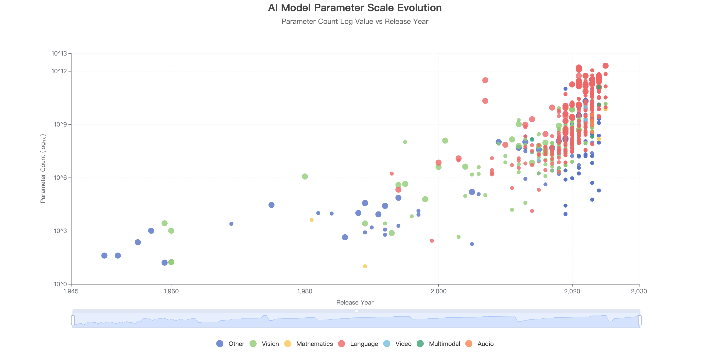

# DeepSight AI


This project draws inspiration from Epoch AI's work, aiming to accumulate and summarize insights in the AI field through reliable data, solid computational reasoning, and data mining to create robust visualized charts. The entire workflow is AI-assisted (using tools like Cursor).

## 🎯 Project Overview

**DeepSight AI** is an artificial intelligence model analysis and visualization project based on Epoch AI data. This project focuses on providing deep insights into AI model development trends through comprehensive data analysis and visualization.

[Live Demo](https://aidoge-lab.github.io/)



## 📊 Data Sources

- **956 Notable AI Models** from Epoch AI dataset (1950-2025)
- **41 Comprehensive Dimensions** including parameters, training compute, publication dates, organizations, etc.
- **SQLite Database** for efficient storage and querying
- **Real-time Data Processing** with automated ETL pipeline

## 🚀 Getting Started

### Prerequisites
```bash
pip install -r requirements.txt
```

### Database Setup
```bash
cd db
python setup_database.py
```

### Generate Insights Procedure
TBD

## 📁 Project Structure

```
DeepSight-AI/
├── data/models/          # Raw data and conversion scripts
├── db/                   # SQLite database and utilities
├── insights/             # Analysis modules and visualizations
├── prompts/              # AI prompts for generating insights
└── template/             # Reusable templates
```

## 📝 Data Attribution

**Data Source**: Epoch AI, 'Data on Notable AI Models'. Published online at epoch.ai. Retrieved from 'https://epoch.ai/data/notable-ai-models' [online resource].

## 📄 License

This project is licensed under the MIT License - see the [LICENSE](LICENSE) file for details.

---
